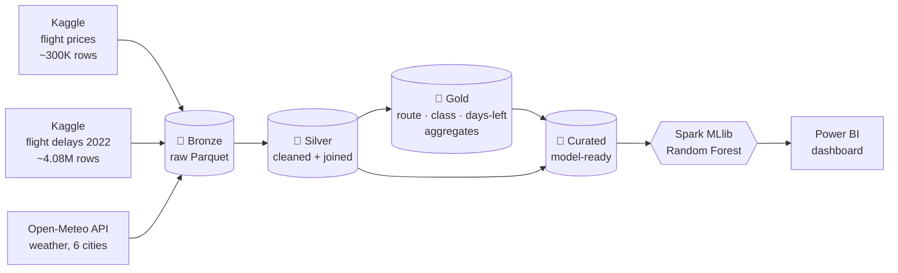
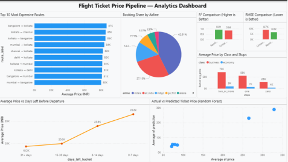

# ✈️ Flight Price Pipeline

**A four-layer PySpark medallion pipeline that joins flight prices, flight delays and weather, then predicts ticket prices with Spark MLlib.**

Built for SECP3843 (Special Topic in Data Engineering) at Universiti Teknologi Malaysia, with an IEEE-format paper written under lecturer supervision.


---

## The short version

| | |
|---|---|
| **Data in** | ~300K flight price rows, ~4.08M flight delay rows, 294 daily weather records |
| **Layers** | Bronze (raw Parquet) → Silver (cleaned, joined) → Gold (3 aggregate tables) → Curated (model-ready) |
| **Model** | Random Forest regressor vs. a linear regression baseline |
| **Result** | Random Forest: **R² 0.911, RMSE 6,553.63**. Linear baseline: R² 0.841, RMSE 8,742.76 |
| **Out** | Gold tables and predictions exported to CSV for a Power BI dashboard |

## Architecture



### What happens in each layer

**🥉 Bronze: land it untouched**
- Flight prices (`Clean_Dataset.csv`, 300,153 rows × 12 cols) and flight delays (`Combined_Flights_2022.csv`, 4,078,318 rows × 61 cols) are read as-is and saved as Parquet.
- Daily weather for Delhi, Mumbai, Bangalore, Kolkata, Hyderabad and Chennai (11 Feb to 31 Mar 2022, matching the price data's booking window) is pulled from the Open-Meteo archive API.

**🥈 Silver: clean and combine**
- Drops the index and flight-code columns, removes duplicates and non-positive prices, and normalises text fields to lowercase.
- Flags price outliers per route (more than 3 standard deviations from the route mean) instead of deleting them, so the dashboard can still show them.
- Adds delay context: average departure delay, arrival delay and cancellation rate for Feb to Mar, taken from the delay dataset.
- Adds per-city weather averages (max/min temperature, rainfall, wind speed).
- Result: **297,940 clean rows**.

**🥇 Gold: answer business questions**
- `avg_price_by_route`: average, min and max price per route and airline
- `avg_price_by_class`: price by cabin class and number of stops
- `avg_price_by_days_left`: how price changes as departure gets closer

**💎 Curated: get it ready for the model**
- Silver joined with the route-and-airline average price from Gold, giving one wide table the model can read directly.

## The model


- **Features:** 7 categorical columns (airline, cities, departure/arrival time, stops, class) encoded with `StringIndexer`, plus 10 numeric ones (duration, days left, delay stats, weather, route-airline average price).
- **Split:** instead of a random split, I used `days_left` as a time proxy. Bookings made more than 15 days out are training data (217,204 rows); the last 15 days are test data (80,263 rows). This mimics predicting prices for bookings that happen *later*.
- **Models:** `RandomForestRegressor` (100 trees, max depth 10) and a `LinearRegression` baseline, each wrapped in a Spark ML `Pipeline`.

| Model | RMSE | R² |
|---|---:|---:|
| **Random Forest** | **6,553.63** | **0.9106** |
| Linear Regression | 8,742.76 | 0.8408 |

The Random Forest explains about 91% of price variance and cuts error by roughly 25% compared with the baseline.

## Repo structure

```
flight-price-pipeline/
├── flight_pipeline.ipynb              # the full pipeline, Bronze to model to exports
├── INDIVIDUALPROJECT_AINNURNABILA.pdf # IEEE-format paper
├── requirements.txt
└── README.md
```

## Run it yourself

1. Download both datasets from Kaggle:
   - Flight price data: `Clean_Dataset.csv`
   - Flight delay data: `Combined_Flights_2022.csv`
2. In Google Drive, create `flight_pipeline/raw/kaggle/` and `flight_pipeline/raw/delay/`, and put the CSVs there.
3. Open `flight_pipeline.ipynb` in Google Colab and run all cells. The notebook installs PySpark, mounts Drive, and creates the Bronze, Silver, Gold, Curated and exports folders itself.
4. The weather step calls the free Open-Meteo API, so you don't need an API key.
5. Load the CSVs from `exports/` into Power BI to rebuild the dashboard.

## What I'd improve next

- **Leakage check:** the `route_airline_avg_price` feature is computed on all rows, including the test period. Computing it from training rows only would make the score more honest.
- **Better delay signal:** the delay dataset covers US flights, while the price data covers Indian domestic routes, so the delay figures work as general industry context, not per-flight features. A matching delay source would make that feature more useful.
- **Move off Colab:** swap Google Drive paths for config variables and schedule the pipeline (e.g. with Airflow) instead of running cells by hand.

---

<sub>Built by <a href="https://bellaazharr.github.io">Ain Nurnabila</a> · Final year CS (Data Engineering) @ UTM</sub>
